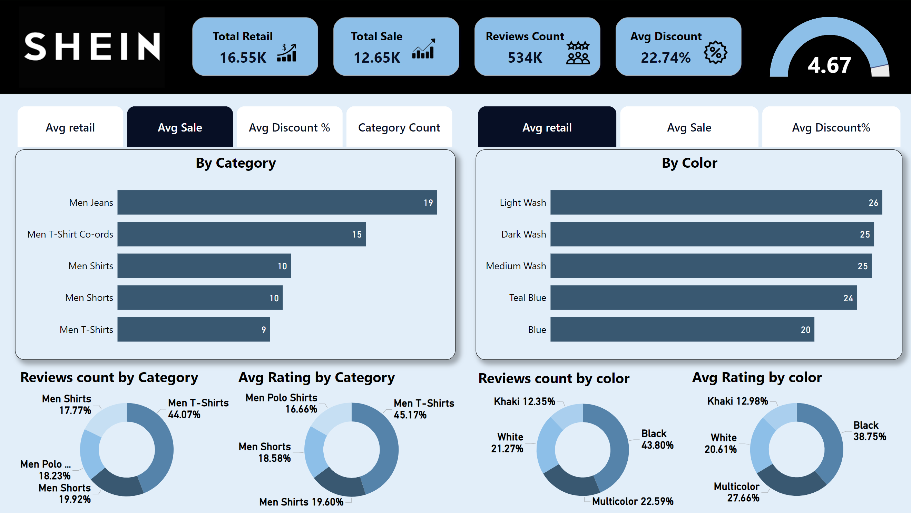

# SHEIN Men's Fashion Insights

## 📊 Project Overview  
This project presents an interactive Power BI dashboard analyzing **Shein Men’s Fashion** data. It provides insights into product categories, customer reviews, ratings, and pricing trends, empowering businesses to understand consumer preferences and optimize strategies.  

Portfilio Dashboard:  

## 🔑 Key Features  
- **Data Modeling**: Built a star schema for smooth table relationships and accurate data analysis.  
- **KPIs & Metrics**: Total sales, total retail, reviews count, and average discounts.  
- **Visual Insights**:  
   - Category performance by sales and reviews.  
   - Popular product colors and ratings.  
   - Key trends in discount impact on sales.  
- **Regex Implementation**: Extracted product attributes like **colors, fits**, and **materials** from text descriptions for deeper analysis.  

---

## 🛠️ Tools Used  
- **Power BI** for visualization and analysis.  
- **SQL** for data transformation and modeling.  
- **Regex** for extracting attributes.  

---

## 📈 Insights Generated  
1. **Top Categories**: Men T-Shirts lead in reviews and average sales.  
2. **Popular Colors**: Black and Multicolor dominate reviews and ratings.  
3. **Discount Influence**: ~22.7% average discount has a strong effect on sales. 
